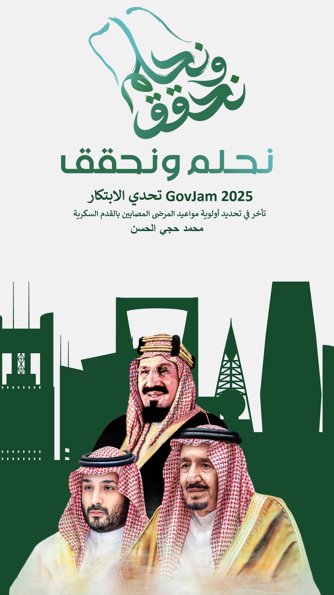
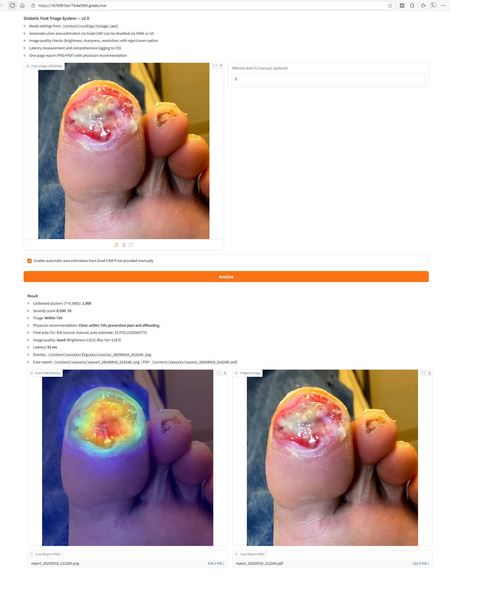

# GovJam-2025
AI prototype for diabetic foot ulcer triage – GovJam 2025 Innovation Challenge

<div align="center">
  
</div>

# GovJam 2025 — AI Prototype for Diabetic Foot Ulcer Triage

نموذج أولي يستخدم الذكاء الاصطناعي لتسريع **تحديد أولوية العلاج** لمرضى **القدم السكري**. يقدّم النظام تصنيفًا فوريًا لمستوى الخطورة مع شرح بصري (Grad-CAM) واقتراحات أولية للإجراء التالي، بهدف تقليل التأخير في تقديم الرعاية وتجنب المضاعفات الخطيرة.


## 🚀 Quick Start
لتجربة النموذج مباشرة على Google Colab اضغط الزر:

[](https://colab.research.google.com/github/mohalhassanmoh/GovJam-2025/blob/main/GovJam_2025.ipynb)

---


## 🎯 الهدف
- تقليل زمن الفرز (Triage) عبر تنبؤ آلي بمستوى الخطورة من صور القدم.
- دعم القرار السريري بإظهار مناطق الاشتباه بصريًا وملخص توصيات أولية.
- تمهيد الطريق لدمج الذكاء الاصطناعي في مسارات العمل السريرية الواقعية.

---

## ✨ المزايا الرئيسية
- **تصنيف ثنائي للمخاطر**: (High / Medium / Low) مع احتمال p(ulcer).
- **Grad-CAM**: إبراز المناطق الأكثر إسهامًا في القرار لزيادة الشفافية.
- **تقدير تقريبي للمساحة المتأثرة** من خريطة التفعيل (للدعم وليس للتشخيص).
- **واجهة تفاعلية Gradio**: رفع الصورة → نتيجة فورية → حفظ تقرير بصيغة PNG/PDF.
- **سجلّات تشغيل**: CSV للنتائج وضبط الإعدادات من YAML.
- **تشغيل مرن**: على Colab .

---

## 🧱 البنية التقنية (Tech Stack)
- Python, PyTorch, Torchvision
- EfficientNet-B0 (قابلة للاستبدال بنماذج أخرى مثل ResNet-18)
- Gradio لواجهة المستخدم
- Grad-CAM للتفسير البصري
- YAML لإدارة الإعدادات

---

## 🗂️ هيكل المستودع (مختصر)
```text
.
├── configs/ # ملفات الإعدادات (YAML)
├── data/    # البيانات (مثال/روابط/تعليمات جلب)
├── models/  # النماذج والوزنات المدربة
├── reports/ # التقارير والصور المولدة
├── src/     # الكود: التدريب/الاستدلال/التقييم/الواجهة
└── README.md
```

---

## 🚀 البدء السريع

### عبر Google Colab
1) افتح الدفتر الرئيسي `GovJam_2025.ipynb` وشغّل الخلية الأولى لجلب المستودع وتثبيت المتطلبات.  
2) شغّل آخر خلية (Run all) لتشغيل واجهة **Inference/Gradio** باستخدام بيانات التدريب السابقة مباشرة، أو أعد التدريب من البداية، أو استخدم بياناتك الخاصة.


---

## 🔍 كيف يعمل؟
- **المعالجة المبدئية**: تغيير الحجم/التطبيع.  
- **الاستدلال**: نموذج تصنيفي (مثل EfficientNet-B0) يعيد p(ulcer).  
- **تحديد الخطورة**: تحويل p إلى فئات Low/Med/High وفق عتبات قابلة للضبط (`τ1`, `τ2`).  
- **التفسير البصري**: Grad-CAM لإبراز المناطق المرجّحة.  
- **المخرجات**: نتيجة رقمية + شارة اللون + صورة تراكبية + تقرير محفوظ + سجل CSV.

---

## ✅ النتائج المتوقعة (Demo)
- **صورة إدخال** → احتمال الإصابة + فئة الخطورة + Grad-CAM.  
- **تقرير تلقائي**: اسم الملف، التنبؤ، العتبات، وقت المعالجة، ومسار الحفظ.
<div align="center">
  
</div>


> **أضف** لقطة شاشة أو GIF لواجهة Gradio والنتائج هنا.

---

## 🧪 خارطة الطريق (Roadmap)
- دعم **تقسيم آفات** دقيق (Segmentation) لقياس المساحة بدقة أعلى.  
- تحسين ضبط العتبات ومعايرة الاحتمال (Calibration).  
- تجارب بنماذج بديلة (ResNet-18/50, ConvNeXt, ViT).  
- حزمة تقييم قياسية (AUROC, F1, Precision/Recall، وتحليل أخطاء).  
- تكامل اختياري مع نظم المستشفيات (HL7/FHIR) في مراحل لاحقة.

---

## ⚖️ الاستخدام والمسؤولية
- ليس جهازًا طبيًا ولا بديلاً عن التشخيص السريري.  
- النتائج **مساعدة** وليست نهائية؛ القرار للطبيب المختص.  
- تأكد من إزالة أي بيانات تعريفية وحماية الخصوصية وفق الأنظمة المحلية.

---

## 🤝 المساهمة
مرحبًا بالملاحظات والمساهمات (Issues/PRs).  

---

## 📜 الترخيص
 نوع الرخصة (MIT).  
انظر الملف `LICENSE`.

---

## 🙏 شكر وتقدير
- مجتمع GovJam 2025.  
- الباحثون والمشاركون في مجموعات بيانات القدم السكري.

---

## 📬 نبذة واتصال

أنا **Mohammed Al-Hassan** — مبتكر حلول **AI في الرعاية الصحية** مع اهتمام خاص بتسريع الفرز الطبي وتحليلات الصور الطبية. أعمل على بناء نماذج عملية يمكن دمجها في بيئات المستشفيات وتحسين تجربة المريض وكفاءة القرار السريري.

**للتواصل والتعاون:**
- 🔗 LinkedIn: [linkedin.com/in/mohammed-alhassan](https://www.linkedin.com/in/mohammed-alhassan-776137285)
- 📧 Email: mohalhassan@moh.gov.sa
- 🧑‍💻 GitHub: [github.com/mohalhassanmoh](https://github.com/mohalhassanmoh)
- 🌍 المملكة العربية السعودية | متاح للتعاون في مشاريع الذكاء الاصطناعي الصحية والابتكار

> أحب العمل على نماذج قابلة للنشر السريع (Colab/Gradio/API) مع توثيق واضح وتجارب توضيحية يمكن تشغيلها مباشرة.


